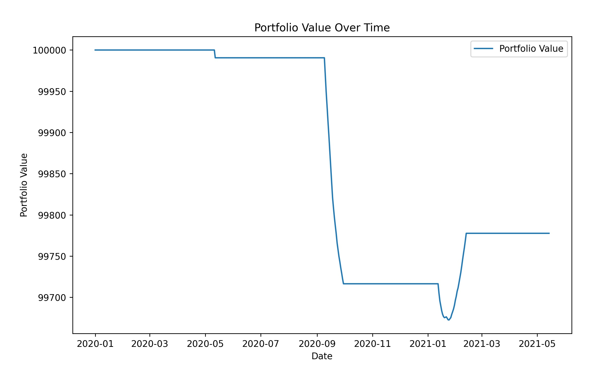
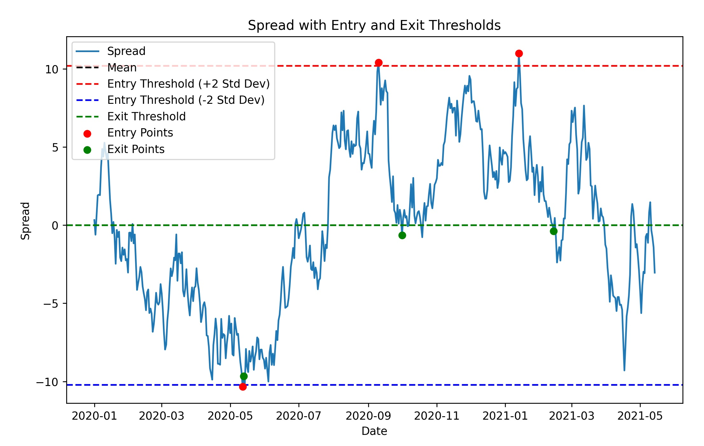

# Statistical Arbitrage Strategy with Cointegration

## Overview

This is a simple Python program to understand the basics of **Statistical Arbitrage** (Stat Arb). It walks through:

1.  **Cointegration Test**: Testing if two assets are cointegrated, which means their prices move together in the long term, making them suitable for a pairs trading strategy.
2.  **Modeling the Spread**: Calculating the spread between two assets using linear regression.
3.  **Entry and Exit Signals**: Generating trading signals when the spread deviates significantly from its mean.
4.  **Backtesting**: Simulating the performance of the strategy over time and visualizing the portfolio performance.
5.  **Visualization**: Plotting the portfolio value and the spread with entry and exit points.

## Steps

### 1. **Setup**

Install required libraries:
```bash
pip install pandas numpy statsmodels matplotlib
```

### 2. **Data**

The program uses **randomly generated price data** for two assets.

### 3. **Cointegration Test**

Use `coint()` to check if the assets are cointegrated:

-   If the p-value < 0.05, the assets are cointegrated and suitable for Stat Arb.

### 4. **Spread Modeling**

A linear regression predicts one asset’s price using the other, and the **spread** is calculated as the difference between actual and predicted prices.

### 5. **Trading Signals**

-   **Entry Threshold**: Spread > (Mean ± 2 * Std Dev).
-   **Exit Threshold**: Spread reverts to the mean.

### 6. **Backtesting**

Simulates trades based on the signals, calculates portfolio value, and tracks performance over time.
## Example Output

```bash
Cointegration Test p-value: 0.3424181037499916
Spread Mean: -5.3660187404602763e-14
Spread Std Dev: 5.106547769214354
Final Portfolio Value: 99777.6834577597
```
The script will also generate the following plots:

1.  **Portfolio Value Over Time**: A graph showing how the portfolio value evolves over time.

2.  **Spread with Entry and Exit Thresholds**: A plot displaying the spread between the two assets, along with entry and exit thresholds and marked entry/exit points.


## Customization

-   **Data Input**: Replace the simulated data with actual price data for the assets you want to trade.
-   **Entry/Exit Thresholds**: Adjust the entry and exit thresholds based on your desired risk/reward profile.
-   **Initial Capital**: Change the `initial_cash` variable to reflect your starting portfolio value.

## Notes

This is a basic implementation to learn the Statistical Arbitrage Strategy. To improve:

-   Use real data (e.g., stock prices).
-   Account for transaction costs and risk.
-   Experiment with different thresholds.

Run the program, visualize the results, and tweak to deepen your understanding!